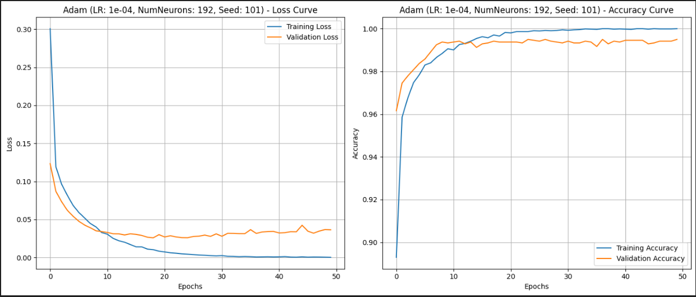
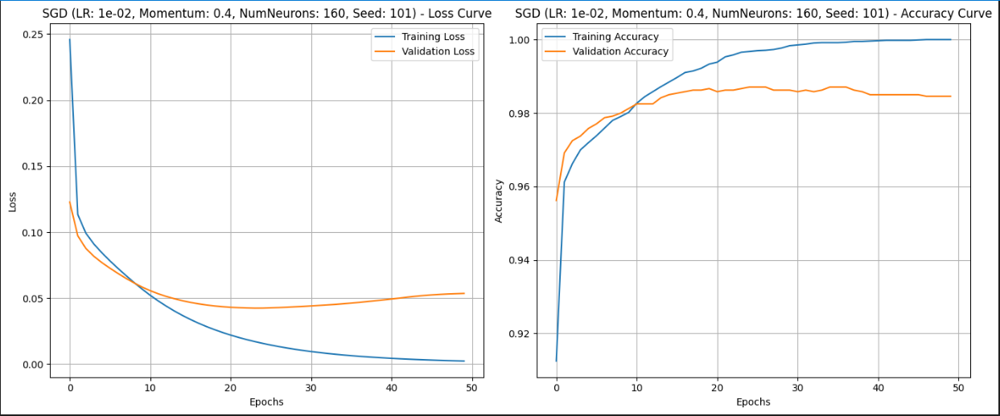
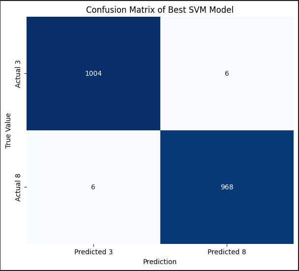

# Convex vs. Non-Convex Optimization – MNIST Binary Classification
---

##  Objective

This project compares the performance of three optimization techniques applied to a binary classification task on MNIST (digits 3 vs. 8):
- **SMO** for **SVM** (convex optimization),
- **SGD** and **Adam** for a **Multilayer Perceptron (MLP)** neural network (non-convex optimization).

The objective is to evaluate their efficiency, stability, and algorithmic complexity to guide the selection of an optimizer based on the application context.

---

##  Methodology

- **Dataset**: MNIST filtered to digits 3 and 8  
- **Preprocessing**: normalization, flattening, binary label encoding  
- **Models evaluated**:  
  - SVM with RBF kernel (optimized using SMO)  
  - MLP (2 hidden layers) with Adam and SGD  
- **Hyperparameter tuning**:  
  - SVM: `HalvingGridSearchCV` for C and gamma  
  - MLP: fixed architecture and learning rates  
- **Evaluation**: Accuracy, F1-score, ROC AUC, confusion matrix, and multi-seed robustness analysis

---
##  Main Results

| Model         | Accuracy | F1-score | AUC    | Inter-seed Robustness |
|---------------|----------|----------|--------|------------------------|
| **SVM (SMO)** | 99.40 %  | 0.9938   | 0.9998 | Perfect              |
| **MLP (Adam)**| 99.34 %  | 0.9933   | 0.9994 | Good                 |
| **MLP (SGD)** | ~98.8 %  | ~0.9887  | ~0.996 | Variable             |

---
##  Visualizations

### RLoss and Accuracy Curves – MLP with ADAM (LR = 1e-4, Seed = 101)

This figure illustrates the learning behavior of a Multilayer Perceptron trained with the Adam optimizer.  
- **Left (Loss)**: Both training and validation losses decrease quickly during the first 10 epochs. Training loss continues toward zero, while validation loss stabilizes around 0.02, indicating no overfitting.  
- **Right (Accuracy)**: Accuracy on both training and validation sets increases rapidly, reaching over **99%**, with minimal generalization gap.  
 The model shows stable convergence and strong generalization under Adam with a low learning rate and consistent initialization.
---
### Training Curves – MLP with SGD (LR = 1e-2, Momentum = 0.4, 160 Neurons, Seed = 101)

This graph shows the evolution of training and validation metrics for an MLP trained with SGD:
- **Loss Curve (left)**: Training loss decreases steadily, but validation loss increases slightly after epoch 20, suggesting the onset of overfitting.
- **Accuracy Curve (right)**: Training accuracy approaches 100%, while validation accuracy plateaus and begins to decline—further indication of reduced generalization beyond a certain point.
 These results highlight the importance of regularization or early stopping when using SGD with high learning rates, to preserve validation performance.
---
###  Confusion Matrix – SVM with SMO (Best Model) 

This confusion matrix displays the classification performance of the best Support Vector Machine (SVM) model using the SMO optimizer on the MNIST binary task (digits 3 vs. 8):

-  The model correctly predicted **1004 images of digit 3** and **968 images of digit 8**.
-  Only **6 instances** of each class were misclassified, showing near-perfect generalization.
-  The symmetry of errors and high true positive counts suggest excellent balance and stability between classes.
This highlights the **robustness and discriminative power of SVM with convex optimization**, especially when tuned effectively.
---
### Future Work
* Extend to multi-class classification (digits 0–9)

* Test additional optimizers: AdamW, L-BFGS, RMSProp

* Analyze the loss landscape topology

* Explore AutoML techniques for automated hyperparameter tuning

* Evaluate robustness with additional random seeds and noise scenarios
---
### Annexes
* Dataset used: MNIST via sklearn or torchvision

*  images/ folder includes:

* ROC curve for SVM with SMO

* Confusion matrices for MLP (Adam), MLP (SGD), SVM

* Loss and accuracy curves for:

* MLP + Adam (adam_loss_accuracy.PNG)

* MLP + SGD (sgd_loss_accuracy.PNG)

* Training logs and metrics are visible directly in the executed notebooks

* All results based on training with seed = 101 and tuned hyperparameters
---
##  Reproduce the Experiment

```bash
git clone https://github.com/meriem-alla/SVM_MLP-Project.git
cd SVM_MLP-Project
#Run the notebooks using Jupyter Notebook or VS Code

  


